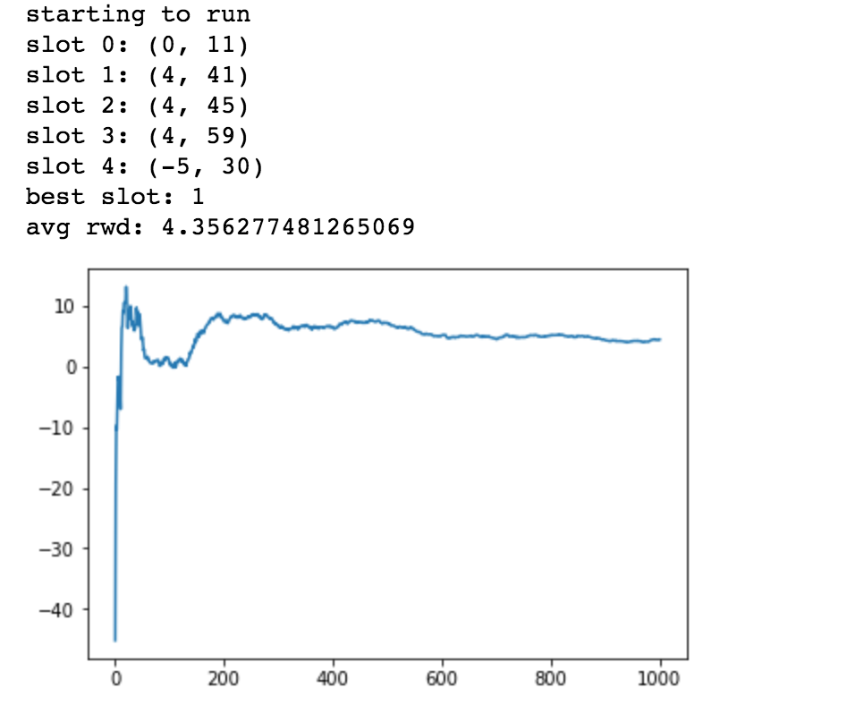

# k-armed-bandit simulators 

This a repository of different types of k-armed bandit algorithms as outlined in 

# Stationary Bandit 
 </img>

This is an example of the output of the k-armed-bandit simulator in the python notebook. After many iterations it finally converges to the slot machine with the highest reward and lowest varience. 

# Reference
_Reinforcement Learning: An Introudction, Barto and Sutton (2017)_

